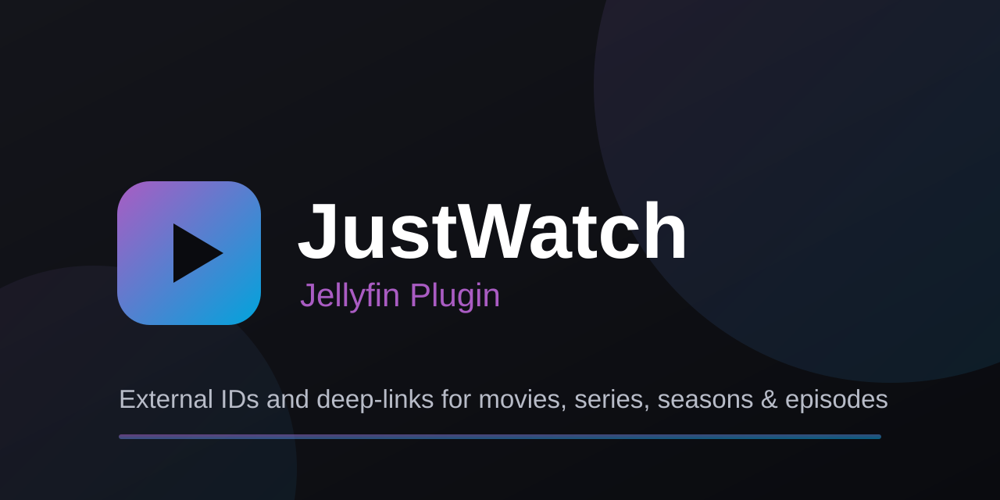

<p align="center">
  
</p>

<h1 align="center">Jellyfin JustWatch Plugin</h1>

<p align="center">
Adds <b>JustWatch</b> external IDs and clickable deep-links to movies, series, seasons, and episodes,
with an optional task to resolve those links automatically.
</p>

<p align="center">


</p>

## Features

- **JustWatch external ID** on Movie, Series, Season, and Episode. It shows up as an editable field
  in the Jellyfin metadata editor; the value is a JustWatch `fullPath`, e.g.
  `/us/movie/leon-the-professional`.
- **Deep-link** in each item's external links. Seasons and episodes have no JustWatch page of their
  own, so they link to the season page built from the parent series id.
- **Resolve JustWatch links**: an optional, off-by-default scheduled task that fills in the JustWatch
  ID for movies and series that lack one, by searching JustWatch's GraphQL API (matched on TMDB or
  IMDb id, then title and year). It also derives season IDs from each resolved series.

## Installation

### From the plugin catalog (recommended)

1. In the dashboard: **Plugins → Repositories → +**.
2. Add the repository (any name) with this URL:

   ```
   https://raw.githubusercontent.com/IDisposable/jellyfin-plugin-justwatch/main/manifest.json
   ```

3. Open the **Catalog** tab, find **JustWatch** under *Metadata*, and click **Install**.
4. Restart Jellyfin.

New releases show up in the catalog automatically.

### Manual

Download the `.zip` from the [latest release](https://github.com/IDisposable/jellyfin-plugin-justwatch/releases),
extract it into a folder under your server's `config/plugins/` directory (e.g.
`config/plugins/JustWatch/`), and restart Jellyfin.

Requires a server matching the plugin's `targetAbi` (currently `10.11.0.0`, `net9.0`).

## Configuration

In the dashboard, go to Plugins > JustWatch:

| Setting | Default | Description |
|---|---|---|
| `ResolveLinksEnabled` | `false` | Enables the resolver task (uses the unofficial API). |
| `Country` | `US` | Country code (ISO 3166-1 alpha-2) for JustWatch lookups. |
| `Language` | `en` | Language code (ISO 639-1) for JustWatch lookups. |
| `RequestDelayMs` | `300` | Delay between resolver lookups, in ms. Throttles the unofficial API. |
| `RecheckUnmatchedDays` | `30` | Days to skip an unmatched item before retrying it. `0` = never re-check. |

The settings page also shows resolver coverage (matched / unmatched / not-yet-searched), a
**Re-resolve now** button that re-queries items the unmatched cache would otherwise skip, and a
**List unmatched** button that lists the items the resolver couldn't match (each links to the item so
you can set its JustWatch id by hand). The task also runs weekly by default (editable under
Dashboard > Scheduled Tasks).

You can also set a JustWatch ID by hand in an item's metadata editor without enabling the task.

## Unofficial API

The resolver task calls JustWatch's undocumented GraphQL endpoint
(`https://apis.justwatch.com/graphql`), which can change or break without notice and is intended for
personal use. It is off by default and runs only when triggered. The ID field and deep-links work
without it. For officially licensed availability data, use TMDB's `watch/providers` instead.

## How it integrates

This is a self-contained provider plugin with no dependency on other plugins. Anything that wants the
data reads `ProviderIds["JustWatch"]` from the item through the host, so there is no assembly
reference or shared type between plugins.

## Building

```bash
dotnet build Jellyfin.Plugin.JustWatch.sln
dotnet test  Jellyfin.Plugin.JustWatch.sln
```

The csproj files reference the published `Jellyfin.Controller` / `Jellyfin.Model` NuGet packages
(version `10.11.11`, compile-only via `ExcludeAssets="runtime"`), so the repo builds standalone — no
Jellyfin server checkout required.

### Releasing

1. Set `version` in `build.yaml` to the new version (e.g. `10.11.0.1`).
2. Publish a GitHub Release with the matching tag (`v10.11.0.1`).

The `release` workflow packages the plugin, attaches the `.zip` to the release, and updates
`manifest.json` — the catalog picks it up automatically.

## Repository layout

```
Jellyfin.Plugin.JustWatch.sln
build.yaml                          # plugin manifest + single version source
manifest.json                       # catalog/repository manifest
Directory.Packages.props            # central NuGet versions
LICENSE
Jellyfin.Plugin.JustWatch/          # the plugin
  Plugin.cs, ServiceRegistrator.cs
  JustWatch*ExternalId.cs, JustWatchExternalUrlProvider.cs, JustWatchUtils.cs
  Graphql/JustWatchGraphQlClient.cs
  ScheduledTasks/ResolveJustWatchLinksTask.cs
  Api/JustWatchController.cs
  Configuration/PluginConfiguration.cs, configPage.html
Jellyfin.Plugin.JustWatch.Tests/    # xUnit tests
```

## Contributing

Build and tests must stay green; StyleCop and the analyzers run as errors. Add tests for new
behavior. The GraphQL parser is tested against captured sample responses in `SampleResponses`.

## License

MIT. See [LICENSE](LICENSE).
